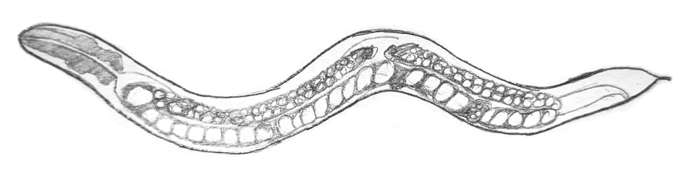

# Artificial Model of Caenorhabditis Elegans: Foraging Behavior Simulation

## Overview
This repository contains the code and resources for my master's thesis on developing an artificial model of the nematode *Caenorhabditis elegans* using reinforcement learning to replicate its movement and foraging behavior. The project involves comparing two models: one trained with the Long Short-Term Memory (LSTM) algorithm typical of reinforcement learning approaches, and another using a gradient descent algorithm.



## Table of Contents
- [Introduction](#introduction)
- [Features](#features)
- [Installation](#installation)
- [Usage](#usage)
- [Acknowledgements](#acknowledgements)

## Introduction
The main goal of this project is to decipher the underlying neural mechanisms and decision-making processes that control locomotor and foraging behavior in C. elegans. The artificial model aims to mimic the natural behavior of C. elegans in a controlled environment and provide insights into its adaptation strategies.

## Features
- **Reinforcement Learning Model**: Implemented using the Long Short-Term Memory (LSTM) algorithm. PPO frame stacking and a custom implementation with hopfield layers is also available. 
- **Gradient Descent Model**: A simpler model used for comparison.
- **Foraging Simulation**: Models are tested in environments with varying food object placements.
- **Performance Metrics**: Total reward and episode length are used to evaluate model performance.
- **Visualization**: Includes traces of agent movements and analysis of movement phases.

## Installation
To run the simulation, follow these steps:

1. Clone this repository:
    ```sh
    git clone https://github.com/die-Anna/worm-world.git
    ```
2. Navigate to the project directory:
    ```sh
    cd worm-world
    ```
3. Install the required dependencies:
    ```sh
    pip install -r requirements.txt
    python worm_world\setup.py install
    ```

## Usage
Command line arguments for starting the most important Python scripts. The main function of most files must be adapted to call a specific trained model.

To train an agent (usable for optimization also):
```sh
python utils/run_training_session.py
```
To plot traces of trained models:
```sh
python utils/create_trace_plots.py
```
To plot the training results of trained models:
```sh
python utils/plot_training_results.py
```
To plot activation functions (LSTM):
```shell
python utils/activations_analysis_regressions.py
```
Create video:
```shell
python utils/create_video.py
python utils/create_video_chemotaxis_algorithm.py # use chemotaxis algorithm
```
Analyze movement phases (video has to be created before):
```shell
python utils/analyze_movement_phases.py
```

## Acknowledgements
This project was developed as part of my master's thesis. I would like to thank my advisors, Dr. rer. nat. Sharwin Rezagholi, MSc. and Charles Fieseler, PhD, for their guidance and support. 